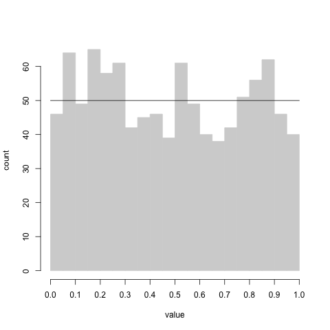
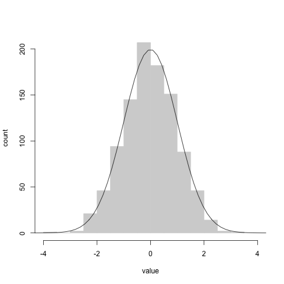

# hardware_rng
Arduino and R code to use a geiger counter as a random number generator

Material here is not meant to be research-grade!  

This is not intended to demonstrate or reflect how modern professional hardware random number generators work.  It does generate sensible results that may well be very usable, but high quality pseudo-random number generators, such as those used in base R random functions, are probably best for almost any purposes.  If you *really* need a hardware RNG, you probably are a cryptographer and you probably don't want to be using ths!  One possible use of the hardware random number generating schemes here could be picking random number seeds.

This repository contains simple Arduino and R code to generate uniform, Gaussian in Poisson random numbers.   These are mainly for proof-of-concept demonstrations.  I find that students are curious about the idea of pseudorandom vs true random numbers. In most cases I can confidently assure students that R's (pseudo)random numbers are very good. But it is potentially an engaging topic to discuss random numbers, and an entry point to interfacing with arbitrary hardware.

## Hardware

True randomness in this project is produced by a 
[kit-built geiger counter from mightohm](https://mightyohm.com/blog/products/geiger-counter/).

Figure 1 shows the connections assumed by the Arduino sketches for generating interrupts from the geiger counter to an Arduino UNO.

## Arduino code

`geiger_rng_poisson.ino` This sketch counts the number of detections in a five second interval, and reports such a count every five seconds over UART.

`geiger_rng_uniform.ino` This sketch records the time of tripletts of sequential detections.  Since detections are independent of one another (except for a very short minimum interval between detections) the time of the second detection should be uniformly distributed between the first and second detections.  This idea is the basis of the random numbers reporte

## R scripts

`geiger_rng_poisson.R` This script connects to serial input, and reads poisson data from the Arduino (assuming it is running the ``geiger_rng_poisson.ino`` sketch, and generates a histogram of the data as they accumulated.

geiger_rng_uniform.R

geiger_rng_gaussian.R

geiger_rng_seed.R

## Sanity checks

*Figure 2.* 1000 uniform random numbers generated compared to the long-run expectation (solid horizontal line).

*Figure 3.* 1000 Gaussian random numbers generated compared to the long-run expectation (unit normal curve).

## Random additional ideas

- I'm not sure of the quality of the uniform, Poisson and Gaussian distributions.  I have not put much thought into consequences of any timing imperfections.  One possible imperfection comes from the behaviour of the Geiger tube itself.  Each detection will cause a brief collapse of the voltage in the detetor tube. Consequently, there is a lower limit on how quickly new detections can occur. This should cause the uniform distribution to be slightly lacking in extremely small and extremely large values. Also, I have not thought through consequences of timing in the Arduino code.

- It is probably possible to re-program the Geiger counter's MCU to output Poisson and uniform random numbers

